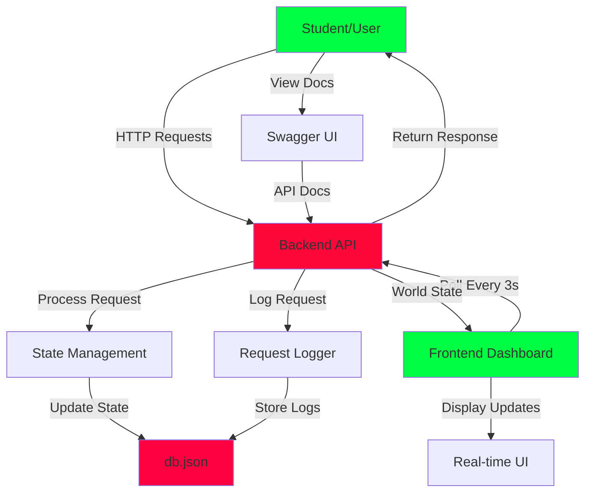

# Stranger APIs - Hawkins Lab Mission Control

A Stranger Things themed API automation playground for students learning API automation. When students send requests via RestAssured/Java to the API, the Frontend Dashboard updates in real-time to visualize the "Mission Progress" in Hawkins.

## 🏗️ Architecture

The application consists of two main components:

- **Backend**: Node.js/Express API with JWT authentication, state persistence via db.json, and Swagger documentation
- **Frontend**: React application with Tailwind CSS, polling every 3 seconds for real-time updates

## 📊 Application Flow



## 🚀 Quick Start

### Backend

```bash
cd backend
npm install
npm run dev
```

API available at `http://localhost:3000` (local) or `https://stranger-api-backend.onrender.com` (production)
- Swagger Docs: `http://localhost:3000/docs` (local) or `https://stranger-api-backend.onrender.com/docs` (production)

### Frontend

```bash
cd frontend
npm install
npm run dev
```

Frontend available at `http://localhost:5173`

## 🔐 Default Credentials

- **Username**: `admin`
- **Password**: `stranger123`

## 📡 API Endpoints

### Authentication
- `POST /auth/login` - Get JWT token
- `POST /auth/session` - Create session with cookie

### Hawkins
- `GET /hawkins/map` - Get energy spikes (with query params: zone, min_energy, limit, offset)
- `GET /hawkins/evidence/{evidenceId}` - Get evidence by ID
- `POST /hawkins/experiments` - Create experiment (nested JSON)
- `POST /hawkins/open` - Open gate using energy spike

### Monsters
- `PATCH /monsters/:id` - Damage monster

### Gate
- `DELETE /gate/:gateId` - Close gate (requires auth)

### Inventory
- `GET /inventory` - Get inventory items
- `POST /inventory/use-item` - Use item (requires auth, stateful)

### Lab
- `POST /lab/upload-evidence` - Upload file (multipart, requires X-Hawkins-Lab-ID header)

### Upside Down
- `GET /upside-down/glitch` - Flaky endpoint (random 503)

### Logs
- `GET /logs/detailed` - Get detailed request logs with headers/cookies

### System
- `GET /health` - Health check
- `GET /world-state` - Get complete world state (frontend)
- `GET /docs` - Swagger documentation

## 🎨 Features

### Backend
- JWT & API Key authentication
- Cookie-based sessions
- Custom headers (X-Hawkins-Lab-ID)
- Query & path parameters
- Nested JSON payloads
- File uploads (multipart/form-data)
- Stateful workflows
- Enhanced request logging
- Negative testing scenarios (400, 401, 404, 422, 503)

### Frontend
- Real-time dashboard updates
- Mission Control panel
- Health bar visualization
- Request logs panel
- Terminal view (detailed headers/cookies)
- Retro 1980s CRT theme

## 🛠️ Environment Variables

### Backend (.env)
```
PORT=3000
JWT_SECRET=your-secret-key
USERNAME=admin
PASSWORD=stranger123
HAWKINS_API_KEY=hawkins-civilian-2024
GLITCH_FAILURE_RATE=30
X_HAWKINS_LAB_ID=LAB-001
```

### Frontend (.env)
```
VITE_API_URL=http://localhost:3000
# Production: VITE_API_URL=https://stranger-api-backend.onrender.com
```

## 📝 Notes

- State persists in `db.json`
- Request logs limited to last 100 entries
- Frontend polls backend every 3 seconds
- Swagger UI available at `/docs` for interactive testing

## 📄 License

MIT
